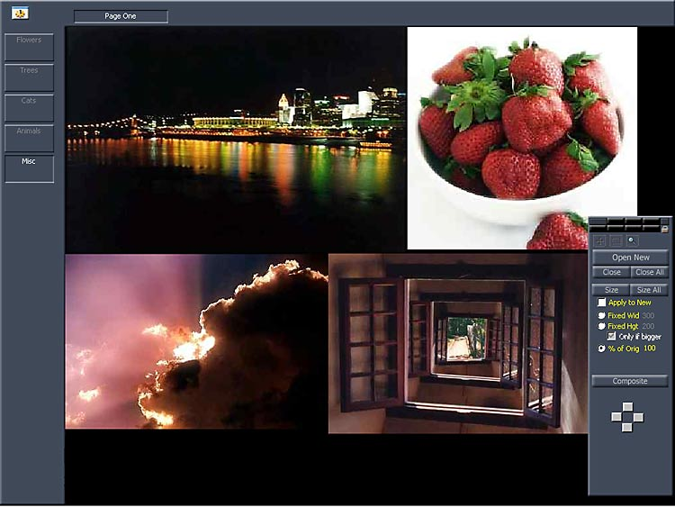

<div align="center">

## Pixie Photo Organizer


</div>

### Description

A complete app which organizes your pictures, with style! Gives you the option to save a copy of your pics in an archive folder and/or in the Pixie database or just show the pics from their original location. You can save pics as JPG to save space or BMP for faster laoding - heaps of features like resize, with bilinear resampling, auto cascade and tiling, etc etc.

if there is no zip file here, then get the source from

http://members.optushome.com.au/kleena/Pixie.htm
 
### More Info
 
Download source from http://members.optushome.com.au/kleena/Pixie.htm

(could not upload to PSC)

This is a beta version - possibly has some bugs and definately has many enhancements to be done yet.

From this source, you can learn how to

Save bmps as jpgs!

Create popup menus using API

Form on top routines

Window size and drag using API

Systray control

BitBlt and StretchBlt

CommonDialog withAPI

and much more

Hopefully, I'll get some constructive criticism and ideas from you lot...

Also, there are a couple bits and pieces which I've used and the authors will be credited in the finished version.


<span>             |<span>
---                |---
**Submitted On**   |
**By**             |[Anthony Neilsen](https://github.com/Planet-Source-Code/PSCIndex/blob/master/ByAuthor/anthony-neilsen.md)
**Level**          |Intermediate
**User Rating**    |3.7 (22 globes from 6 users)
**Compatibility**  |VB 6\.0
**Category**       |[Complete Applications](https://github.com/Planet-Source-Code/PSCIndex/blob/master/ByCategory/complete-applications__1-27.md)
**World**          |[Visual Basic](https://github.com/Planet-Source-Code/PSCIndex/blob/master/ByWorld/visual-basic.md)
**Archive File**   |[](https://github.com/Planet-Source-Code/anthony-neilsen-pixie-photo-organizer__1-34719/archive/master.zip)


### Source Code

```
Get the source code from:
http://members.optushome.com.au/kleena/Pixie.htm
```

